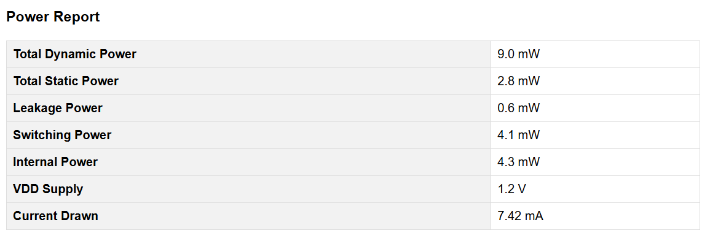

# Log File Scraper 📊

*A powerful GUI-based HTML report generator for VLSI design log files*

---

## 📝 Overview

This tool automates the analysis of Vivado-generated TCL logs in VLSI design workflows. It extracts critical performance metrics including timing violations, power consumption, and resource utilization, presenting them in a clean, interactive HTML report that simplifies design verification.

<table>
<tr>
<td align="center">
<strong>🔠Extract</strong> Parse log files for key metrics
</td>
<td align="center">
<strong>🔄 Process</strong> Transform raw data into insights
</td>
<td align="center">
<strong>📈 Visualize</strong> Generate HTML reports
</td>
</tr>
</table>

## ✨ Features

- *🔄 Automated Log Parsing*: Extract key metrics from Vivado simulation logs using Perl
- *🖱 Interactive GUI*: Simple TCL/Tk interface for file selection and report generation
- *📊 Comprehensive Reports*: Clean HTML tables for timing, power, and utilization data
- *⚠ Error Handling*: Robust validation of inputs and processing steps

## 📋 Sample Reports

### Timing Analysis

### Power Analysis

### Utilization Analysis

## 🔧 Requirements

- [TCL/Tk Interpreter](https://www.activestate.com/products/tcl/) (for GUI)
- [Perl](https://www.perl.org/get.html) (for log parsing)
- Web browser (for viewing HTML reports)

## 📥 Installation

1. Clone this repository:
   bash
   git clone https://github.com/DabMouse/Log-File-Scrapper.git
   cd Log-File-Scrapper
   

2. Ensure Perl and TCL/Tk are installed on your system.

## 🚀 Usage

1. Launch the GUI interface:
   bash
   tclsh gui.tcl
   

2. Use the file browser to select your Vivado log file (sample logs available in the "Log Files (Input)" directory).

3. Click "Generate Report" to create the HTML report.

4. The HTML report will open automatically in your default browser.

## ⚙ Configuration

Before first use, update the following paths in the source files:

<b>Configuration Steps (Click to expand)</b>

1. In gui.tcl, update the path to the Perl script:
   tcl
   exec perl "path_to_your_directory/logscrapper.pl" $logfile_path
   

2. In logscrapper.pl, update the output HTML file path:
   perl
   my $html_file = "path_to_your_output_directory/vivado_report.html";
   

## 🔄 How It Works

<table>
<tr>
<td><b>Step 1</b></td>
<td>The TCL GUI provides a simple interface for file selection</td>
</tr>
<tr>
<td><b>Step 2</b></td>
<td>Selected log files are processed by the Perl script</td>
</tr>
<tr>
<td><b>Step 3</b></td>
<td>The Perl script extracts all relevant metrics using regex pattern matching</td>
</tr>
<tr>
<td><b>Step 4</b></td>
<td>HTML reports are generated with proper formatting and styling</td>
</tr>
<tr>
<td><b>Step 5</b></td>
<td>Reports open automatically in the default browser</td>
</tr>
</table>

## 💡 Use Cases

- 🔶 Rapid verification of design changes in FPGA development
- 🔶 Batch processing of multiple simulation runs
- 🔶 Identifying timing and power bottlenecks in designs
- 🔶 Documentation generation for design reviews

## 👥 Contributors

<table>
  <tr>
    <td align="center"><a href="https://github.com"> <b>Sharvil Pingale</b></a></td>
    <td align="center"><a href="https://github.com"> <b>Anish Shende</b></a></td>
    <td align="center"><a href="https://github.com"> <b>Advaith Rao</b></a></td>
  </tr>
</table>

## 📄 License

This project is available under the MIT License.

---

<i>This tool is designed to enhance productivity in digital design analysis by automating log parsing and report generation tasks.</i>

